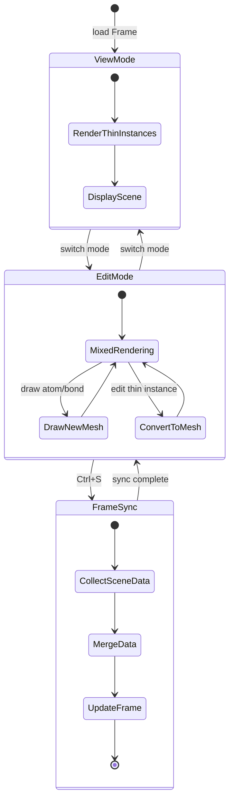
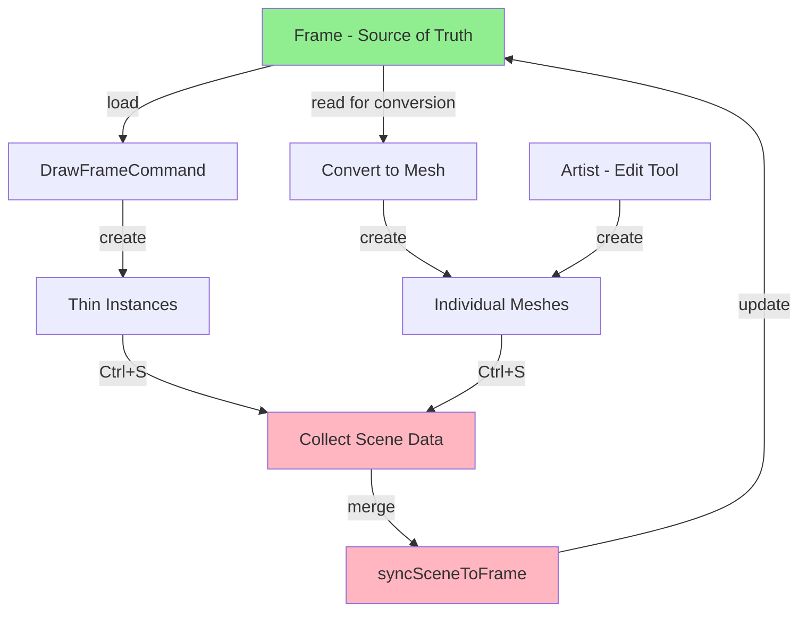

# Design: Unify Frame-Mesh Rendering

## Context

Molvis currently uses two rendering approaches:
- **View mode**: Thin instances (efficient, read-only) rendered from Frame via `DrawFrameCommand`
- **Edit mode**: Individual meshes (interactive, editable) created via `Artist`

The problem is that Frame is not the single source of truth. Edit mode creates meshes that exist only in the scene, making persistence impossible.

### Stakeholders
- **Users**: Need to save their work from Edit mode
- **Developers**: Need a clear data model and state management

### Constraints
- Must maintain performance of thin instances for large structures
- Must preserve interactive editing capabilities
- Cannot break existing View/Edit mode functionality

## Goals / Non-Goals

### Goals
- Establish Frame as the single source of truth for all molecular data
- Enable Ctrl+S to persist Edit mode changes to Frame
- Support editing thin instance atoms by converting them to meshes on-demand
- Maintain clear separation between View (read-only) and Edit (interactive) modes

### Non-Goals
- Real-time synchronization (only on explicit save)
- Undo/redo across mode switches (existing undo stacks are mode-specific)
- Optimizing thin instance editing performance (conversion to mesh is acceptable)

## State Machine

The system has three primary states:



### State Descriptions

**ViewMode**: 
- Frame data → `DrawFrameCommand` → Thin instances
- Read-only visualization
- Efficient rendering for large structures

**EditMode**:
- Mixed rendering: thin instances (from Frame) + meshes (newly drawn)
- Interactive editing via `Artist`
- On-demand conversion: thin instance → mesh when editing begins

**FrameSync**:
- Triggered by Ctrl+S
- Collects all scene data (thin instances + meshes)
- Merges and updates Frame
- Frame becomes saveable

## Data Flow



### Data Flow Steps

1. **Load**: `Frame` → `DrawFrameCommand.do()` → Thin instances in scene
2. **Draw**: User draws → `Artist.drawAtom/drawBond()` → Meshes in scene
3. **Edit Thin Instance**: User edits thin instance → `convertThinInstanceToMesh()` → Delete thin instance + Create mesh from Frame data
4. **Save**: User presses Ctrl+S → `syncSceneToFrame()` → Collect all atoms/bonds → Update Frame

## Decisions

### Decision 1: System Class for Data Management

**What**: Create System class parallel to World for all data/structure management

```typescript
// core/src/core/system.ts
export class System {
  private _currentFrame: Frame | null = null;
  
  get frame(): Frame | null {
    return this._currentFrame;
  }
  
  set frame(value: Frame | null) {
    this._currentFrame = value;
  }
}

// core/src/core/app.ts
export class MolvisApp {
  private _system: System;
  
  get system(): System {
    return this._system;
  }
}
```

**Why**: 
- Separates data management from application lifecycle
- System is parallel to World (World = rendering, System = data)
- Follows single responsibility principle
- Makes data flow explicit

**Alternatives considered**:
- Keep Frame in App: Violates separation of concerns
- Create separate FrameManager: Unnecessary abstraction, System is the manager

### Decision 2: Frame Mutation API

**What**: Add mutation methods to Frame class (located in `core/system/frame.ts`)

```typescript
class Frame {
  addAtom(x: number, y: number, z: number, element: string): number
  removeAtom(atomId: number): void
  addBond(atomId1: number, atomId2: number, order: number): void
  removeBond(bondId: number): void
  clear(): void
}
```

**Why**: Frame currently only supports construction-time data. We need runtime mutation for synchronization.

**Alternatives considered**:
- Create new Frame on each save: Inefficient, loses metadata
- External Frame builder: Adds complexity, unclear ownership

### Decision 3: Consolidate Thin Instance Utilities

**What**: Add conversion functions to existing `core/thin_instance.ts`

```typescript
// core/src/core/thin_instance.ts
export function convertThinInstanceToMesh(
  thinInstanceMesh: Mesh,
  instanceIndex: number,
  app: MolvisApp
): Mesh | null

export function isThinInstanceMesh(mesh: Mesh): boolean
```

**Why**:
- Keeps all thin instance utilities in one place
- Avoids file proliferation
- Easier to maintain and discover

**Alternatives considered**:
- Separate thin_instance_converter.ts: Unnecessary file, adds complexity

**What**: Convert individual thin instances to meshes on-demand when editing begins

**Why**: 
- Preserves thin instance performance for unedited atoms
- Enables interactive editing only where needed
- Avoids converting entire structure upfront

**Alternatives considered**:
- Convert all thin instances to meshes on Edit mode entry: Wasteful, slow for large structures
- Edit thin instances directly: Not supported by Babylon.js, would require custom implementation

### Decision 3: Synchronization Trigger

**What**: Ctrl+S triggers `syncSceneToFrame()`

**Why**:
- Explicit user action (no surprises)
- Familiar save semantics
- Allows batching multiple edits

**Alternatives considered**:
- Auto-sync on every edit: Performance overhead, unclear when Frame is "ready"
- Sync on mode switch: Unexpected behavior, users may not want to persist

### Decision 4: Scene Data Collection

**What**: Traverse scene meshes, extract atom/bond data, rebuild Frame

**Implementation**:
```typescript
function syncSceneToFrame(scene: Scene, frame: Frame): void {
  frame.clear()
  
  // Collect atoms from meshes
  scene.meshes.forEach(mesh => {
    const meta = mesh.metadata as MeshMetadata
    if (meta?.meshType === 'atom') {
      frame.addAtom(mesh.position.x, mesh.position.y, mesh.position.z, meta.element)
    }
  })
  
  // Collect atoms from thin instances
  scene.meshes.forEach(mesh => {
    const meta = mesh.metadata as MeshMetadata
    if (meta?.meshType === 'atom' && meta.matrices) {
      // Extract from transformation matrices
      for (let i = 0; i < meta.atomCount; i++) {
        const pos = getPositionFromMatrix(meta.matrices, i)
        const element = meta.atomBlock.element[i]
        frame.addAtom(pos.x, pos.y, pos.z, element)
      }
    }
  })
  
  // Similar for bonds...
}
```

**Why**: 
- Scene is the current state (includes all edits)
- Frame becomes synchronized with visual representation
- Simple, straightforward approach

## Risks / Trade-offs

### Risk 1: Data Loss on Conversion
**Risk**: Converting thin instance to mesh might lose metadata (atom names, IDs)

**Mitigation**: 
- Store full atom data in thin instance metadata
- Copy all metadata fields during conversion
- Add validation to ensure no data loss

### Risk 2: Performance on Large Structures
**Risk**: Synchronizing 10,000+ atoms could be slow

**Mitigation**:
- Show progress indicator during sync
- Consider incremental sync (only changed atoms) in future
- For v1, accept that large structures may take 1-2 seconds

### Risk 3: Undo/Redo Across Save
**Risk**: Undo stack is cleared after save, users can't undo past save point

**Mitigation**:
- Document this behavior clearly
- Consider Frame-level undo in future (out of scope for this change)
- For now, save is a "commit" operation

## Migration Plan

### Phase 1: Add Frame Mutation API
- Implement `addAtom`, `removeAtom`, `addBond`, `removeBond` in Frame
- Add tests for mutation operations

### Phase 2: Implement Scene Synchronization
- Create `syncSceneToFrame()` utility
- Handle both meshes and thin instances
- Add tests for data collection

### Phase 3: Add Ctrl+S Handler
- Hook Ctrl+S in Edit mode
- Call `syncSceneToFrame()`
- Show confirmation/feedback to user

### Phase 4: Implement Thin Instance Conversion
- Add `convertThinInstanceToMesh()` function
- Trigger on edit operations (delete, drag, modify)
- Preserve all atom metadata

### Rollback
If issues arise:
- Ctrl+S handler can be disabled via feature flag
- Conversion logic can be bypassed (fall back to "cannot edit thin instances")
- Frame mutation methods are additive (no breaking changes)

## Open Questions

1. **Should we auto-save on mode switch?** 
   - Leaning no: Explicit save is clearer
   - User feedback needed

2. **How to handle bond order changes for thin instance bonds?**
   - Convert bond to mesh on order change?
   - Or disallow editing thin instance bonds?

3. **Should we show unsaved changes indicator?**
   - Yes, but out of scope for this change
   - Can be added in follow-up

4. **What happens to undo stack after save?**
   - Clear it (save is a commit)
   - Or preserve it (more complex)?
